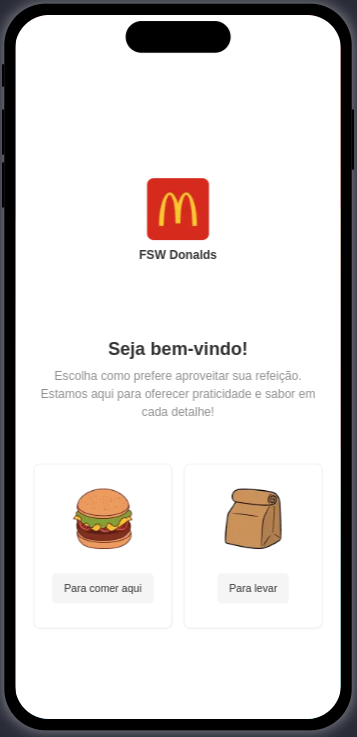
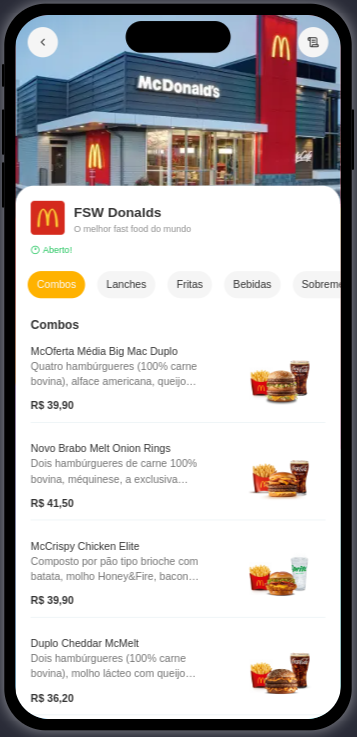
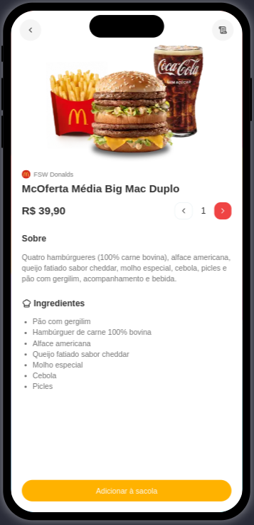
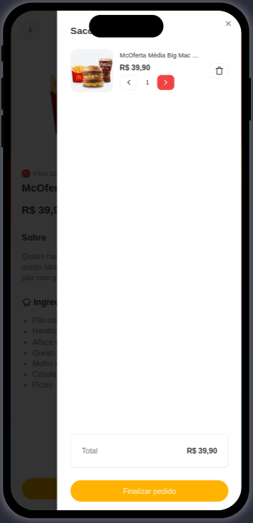
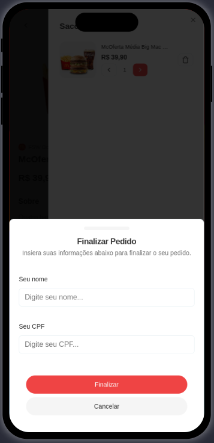
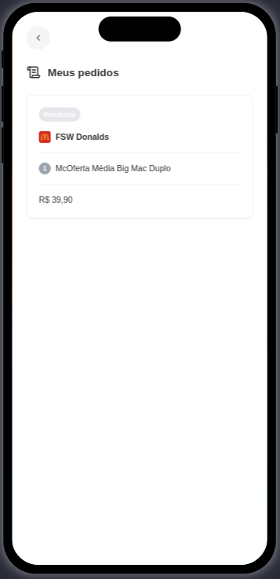
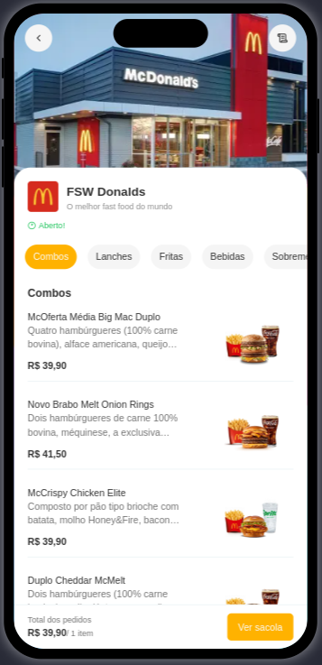
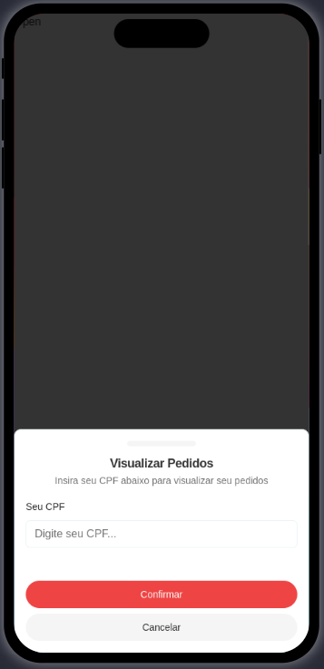

# 🍔 FSW-Donalds - Sistema de Pedidos (Restaurante)


## 🎯 Sobre o Projeto

Desenvolvido para Dispositivos Móveis: Este sistema foi projetado como uma aplicação web, mas otimizado para experiência mobile-first. Embora tenha sido inicialmente pensado para restaurantes de fast food, ele é completamente adaptável a qualquer tipo de estabelecimento gastronômico. O sistema permite que os clientes escolham seus produtos, adicionem à sacola, visualizem detalhes, finalizem o pedido e acompanhem seu status.


## 🔍 Tecnologias Utilizadas

[](https://skillicons.dev)

🖥️ Frontend: React, Next.js, TailwindCSS, Typescript

🔧 Backend: Prisma, Zod + React Hook Form

🗄️ Banco de Dados: PostgreSQL (Neon Serverless)

🛠️ Outras Ferramentas: Lucide, Context API

📌 Versionamento: Git e GitHub seguindo o padrão SemVer (major, minor, patch)

🧩 Componentização: Server Components e Client Components

🔐 Gerenciamento de Variáveis de Ambiente: .env com link gerado pelo Neon


## ⚡ Funcionalidades


🔹 Escolha do tipo de pedido: Comer no local ou levar

🔹 Menu de produtos: Exibição dos itens disponíveis para pedido

🔹 Detalhes do produto: Informações detalhadas, seleção de quantidade e opção de adicionar à sacola

🔹 Carrinho de compras: Visualização dos itens adicionados e total do pedido

🔹 Gestão dinâmica do carrinho: Possibilidade de voltar ao menu e adicionar novos itens

🔹 Rodapé dinâmico no menu: Exibe a quantidade total de itens e acesso rápido à sacola

🔹 Finalização do pedido: Inserção do nome e CPF com validação

🔹 Listagem de pedidos: Organização por CPF, permitindo múltiplos pedidos na mesma lista

🔹 Consulta de status do pedido: Pendente, em preparo ou finalizado


## 📂 Estrutura do projeto

O projeto foi desenvolvido utilizando os seguintes conceitos e padrões:

🔹 Context API: Para gerenciamento de estado global.

🔹 Server Component e Client Component: Para otimização de desempenho e renderização.

🔹 Versionamento Semântico: Seguindo o padrão major.minor.patch para controle de versões.

🔹 `/components/ui` → Componentes da biblioteca shadcn.

🔹 `/context` → Contextos globais para gerenciamento de estado.

🔹 `/lib` → configurações do Prisma e utils.

🔹 `/global.css` → Estilos globais e configurações do Tailwind CSS.

```bash
fsw-donalds/
├── prisma
│   ├── migrations
│   ├── schema.prisma
│   └── seed.ts
├── public
│   ├── dine_in.png
│   └── takeaway.png 
├── README.md
├── src
│   ├── app
│   ├── components
│   ├── Data
│   ├── helpers
│   └── lib
├── tailwind.config.ts
├── tsconfig.json
├── components.json
├── eslint.config.mjs
├── next.config.ts
├── next-env.d.ts
├── package.json
├── package-lock.json
└── postcss.config.mjs

```

## 📸 Demonstração do Sistema

Abaixo estão algumas capturas de tela do sistema em funcionamento:

### | Tela Inicial | 
 

### | Menu de Produtos |


### | Detalhes do Produto |
 

### | Sacola de Compras |


### | Finalização do Pedido |    
 

### | Lista de Pedidos |


### | Menu com Item na Sacola |   
 

### | Consulta de Pedido |



## :globe_with_meridians: Acesso ao Deploy do projeto

### Vercel

O projeto está disponível na Vercel. Você pode acessá-lo através do seguinte link: 

[FSW-Donalds.](https://fsw-donalds-git-main-charlesbrcostas-projects.vercel.app/fsw-donalds)


## 📌 Controle de Versões

O desenvolvimento do sistema seguiu um controle de versões estruturado, garantindo melhorias contínuas e estabilidade:

🔹 `v0.1.0` - Versão inicial e implementação da tabela do banco de dados.

🔹 `v0.1.1` - Adicionado o script de seed para popular o banco de dados e pequenas correções.

🔹 `v0.2.1` - Adicionados componentes do ShadCN, como Button e Input, além de ajustes menores.

🔹 `v0.3.0` - Implementação da página inicial, menu de categorias e produtos.

🔹 `v0.4.0` - Adição da página de detalhes do produto e do contexto do carrinho (CartContext).

🔹 `v0.5.0` - Funcionalidade de adicionar produtos ao carrinho (sacola).

🔹 `v0.5.1` - Correção no scroll da página de detalhes do produto.

🔹 `v0.6.0` - Implementação da funcionalidade para ajustar a quantidade de produtos, remover itens do carrinho e adição do componente de finalização do pedido.

🔹 `v1.0.0` - Adicionado o redirecionamento com CPF, o componente de criação de pedidos e o postinstall com Prisma.

🔹 `v1.1.0` - Ajuste na ordem das importações nos componentes e revalidação do cache ao criar um pedido.

🔹 `v1.2.0` - Ajustes garantindo o funcionamento dos botões "Voltar".

🔹 `v1.2.1` - Correção na descrição da rota do consumptionMethod.

🔹 `v1.2.2` - Redirecionamento da página inicial para a página padrão FSW-Donalds.

🔹 `v1.2.3` - Ajustes finais: correção no alinhamento dos ícones e limpeza automática da sacola após a conclusão do pedido.


## 🚀 Desenvolvimento

Este projeto foi desenvolvido durante a Imersão Fullstack Week, aplicando as melhores práticas e conceitos modernos de desenvolvimento fullstack.


## 🚀 Como Rodar o Projeto

### :dvd: Passo a Passo

1. Clone o repositório:

    ```bash
    https://github.com/charlesbrcosta/fsw-donalds.git
    cd fsw-donalds

2. Instale as dependências:
    ```bash
    npm install ou npm i

3. Configure o banco de dados:

- Crie uma conta na neon serverless postgresql e o banco dados

- Configure as variáveis de ambiente no arquivo .env adicionando o link do banco de dados gerado na Neon.

4. Inicie o servidor de desenvolvimento:
    ```bash
    npm run dev
    
## :handshake: Contribuição

Se você quiser contribuir com o projeto, siga os passos abaixo:

    Faça um fork deste repositório.
    Crie uma nova branch (git checkout -b feature/nova-feature).
    Faça commit das suas alterações (git commit -am 'Adiciona nova feature').
    Faça push para a branch (git push origin feature/nova-feature).
    Abra um Pull Request.

## :student: Autor

[<br><sub>Charles Bruno</sub>](https://github.com/charlesbrcosta)


## :page_facing_up: Licença

Este projeto está licenciado sob a [Licença MIT](https://www.mit.edu/~amini/LICENSE.md).