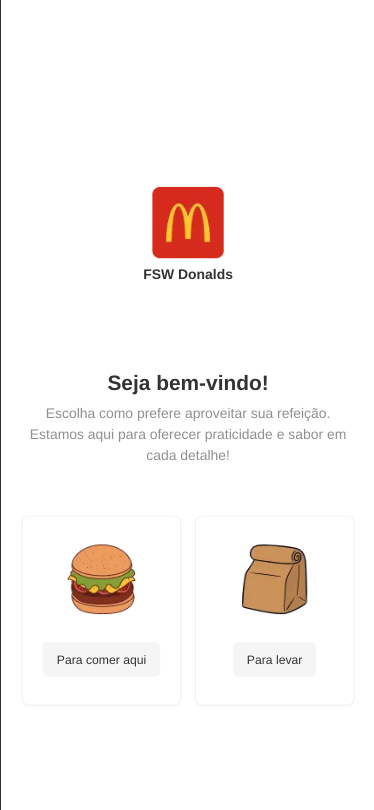
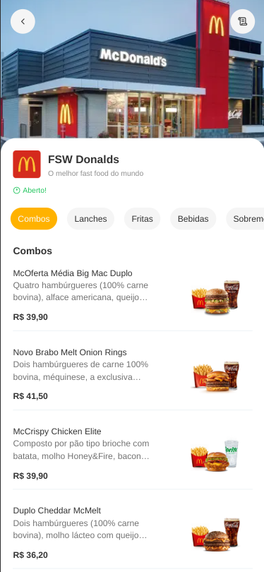
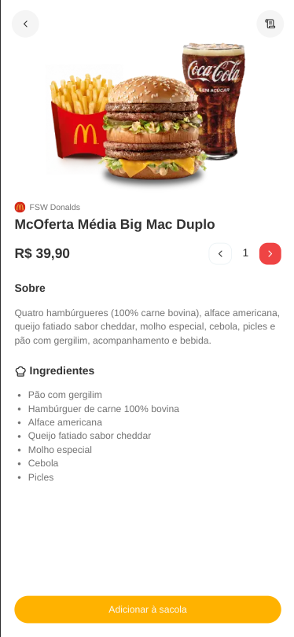
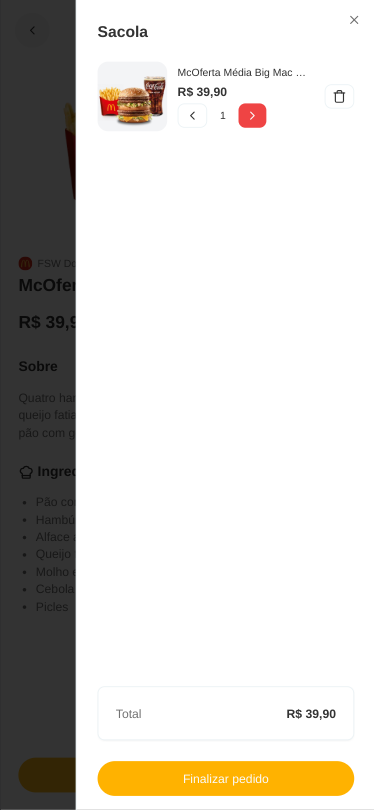
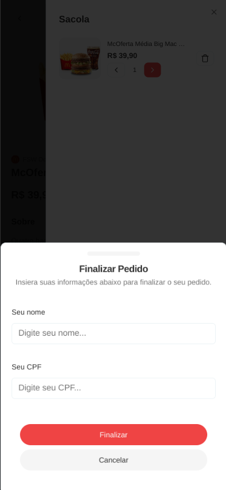
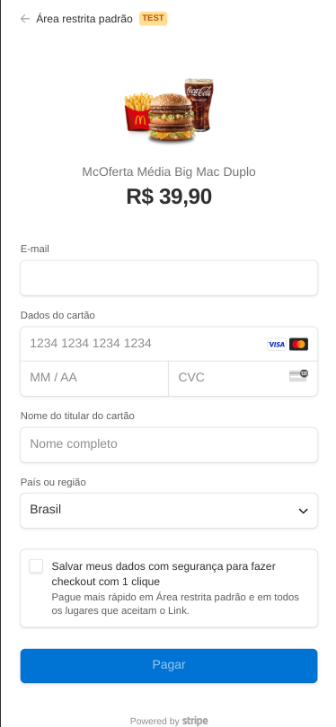
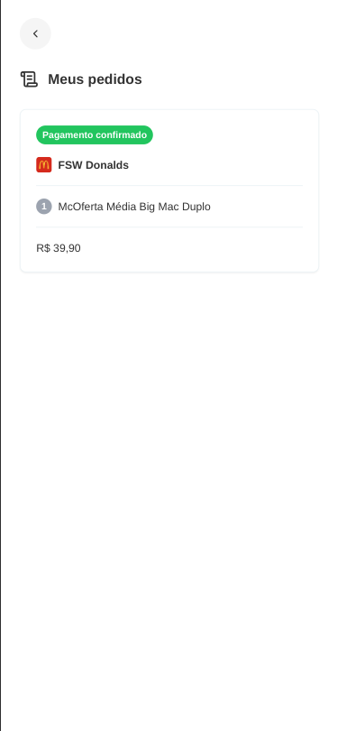
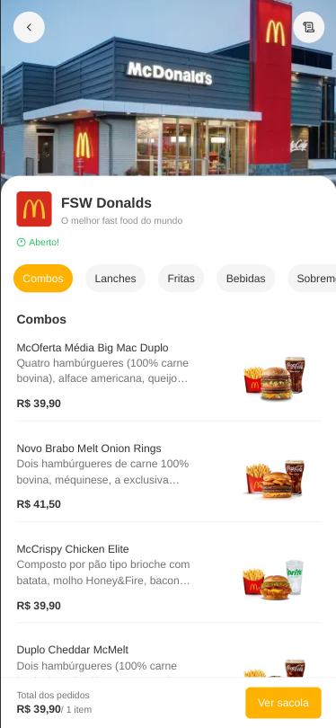
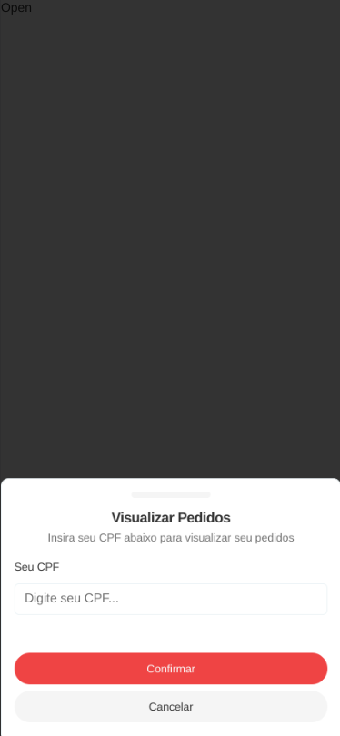

# 🍔 FSW-Donalds - Sistema de Pedidos (Restaurante)

## 🎯 Sobre o Projeto

Desenvolvido para Dispositivos Móveis: Este sistema foi projetado como uma aplicação web, mas otimizado para experiência mobile-first. Embora tenha sido inicialmente pensado para restaurantes de fast food, ele é completamente adaptável a qualquer tipo de estabelecimento gastronômico. O sistema permite que os clientes escolham seus produtos, adicionem à sacola, visualizem detalhes o produto, finalize o pedido com a forma de pagamentão cartão e acompanhem os status.

## 🔍 Tecnologias Utilizadas

[](https://skillicons.dev)

🖥️ Frontend: React, Next.js, TailwindCSS, Typescript

🔧 Backend: Prisma, Zod + React Hook Form

🗄️ Banco de Dados: PostgreSQL (Neon Serverless)

🛠️ Outras Ferramentas: Lucide, Context API, Figma

📌 Versionamento: Git e GitHub seguindo o padrão SemVer (major, minor, patch)

🧩 Componentização: Server Components e Client Components

🔐 Gerenciamento de Variáveis de Ambiente: .env com link gerado pelo Neon

🔗 Forma de pagamento: cartão (integração do stripe com webhook)

## ⚡ Funcionalidades

🔹 Escolha do tipo de pedido: Comer no local ou levar

🔹 Menu de produtos: Exibição dos itens disponíveis para pedido

🔹 Detalhes do produto: Informações detalhadas, seleção de quantidade e opção de adicionar à sacola

🔹 Carrinho de compras: Visualização dos itens adicionados e total do pedido

🔹 Gestão dinâmica do carrinho: Possibilidade de voltar ao menu e adicionar novos itens

🔹 Rodapé dinâmico no menu: Exibe a quantidade total de itens e acesso rápido à sacola

🔹 Finalização do pedido: Inserção do nome e CPF com validação e forma de pagamento cartão (nesta versão do stripe não tem pagamento via pix)

🔹 Listagem de pedidos: Organização por CPF, permitindo múltiplos pedidos na mesma lista

🔹 Consulta de status do pedido: Pendente, em preparo, finalizado, pagamento confirmado ou pagamento falhou


## 📂 Estrutura do projeto

O projeto foi desenvolvido utilizando os seguintes conceitos e padrões:

🔹 Context API: Para gerenciamento de estado global.

🔹 Server Component e Client Component: Para otimização de desempenho e renderização.

🔹 Versionamento Semântico: Seguindo o padrão major.minor.patch para controle de versões.

🔹 `/components/ui` → Componentes da biblioteca shadcn.

🔹 `/context` → Contextos globais para gerenciamento de estado.

🔹 `/lib` → configurações do Prisma e utils.

🔹 `/global.css` → Estilos globais e configurações do Tailwind CSS.

🔹 `/api/webhooks/stripe/route.ts` → Integração do stripe com webhook.

```bash
fsw-donalds/
├── prisma
│   ├── migrations
│   ├── schema.prisma
│   └── seed.ts
├── public
│   ├── dine_in.png
│   └── takeaway.png 
├── README.md
├── src
│   └──  app
│        └── api/webhooks/stripe
│   ├── components
│   ├── Data
│   ├── helpers
│   └── lib
├── tailwind.config.ts
├── tsconfig.json
├── components.json
├── eslint.config.mjs
├── next.config.ts
├── next-env.d.ts
├── package.json
├── package-lock.json
└── postcss.config.mjs

```

## 📸 Demonstração do Sistema

Abaixo estão algumas capturas de tela do sistema em funcionamento:

### | Tela Inicial | 
 

### | Menu dos Produtos |


### | Detalhes do Produto |
 

### | Sacola de Compras |


### | Finalização do Pedido |    
 

### | Pagamento do pedido |


### | Lista dos pedidos |


### | Menu com item na sacola |


### | Visualizar pedido|



## :globe_with_meridians: Acesso ao Deploy do projeto

### Vercel

O projeto está disponível na Vercel. Você pode acessá-lo através do seguinte link: 

Clique aqui para acessar o projeto → [FSW-Donalds](https://fsw-donalds-brown.vercel.app/fsw-donalds)


## 📌 Controle de Versões

O desenvolvimento do sistema seguiu um controle de versões estruturado, garantindo melhorias contínuas e estabilidade:

🔹 `v0.1.0` - Versão inicial e implementação da tabela do banco de dados.

🔹 `v0.1.1` - Adicionado o script de seed para popular o banco de dados e pequenas correções.

🔹 `v0.2.1` - Adicionados componentes do ShadCN, como Button e Input, além de ajustes menores.

🔹 `v0.3.0` - Implementação da página inicial, menu de categorias e produtos.

🔹 `v0.4.0` - Adição da página de detalhes do produto e do contexto do carrinho (CartContext).

🔹 `v0.5.0` - Funcionalidade de adicionar produtos ao carrinho (sacola).

🔹 `v0.5.1` - Correção no scroll da página de detalhes do produto.

🔹 `v0.6.0` - Implementação da funcionalidade para ajustar a quantidade de produtos, remover itens do carrinho e adição do componente de finalização do pedido.

🔹 `v1.0.0` - Adicionado o redirecionamento com CPF, o componente de criação de pedidos e o postinstall com Prisma.

🔹 `v1.1.0` - Ajuste na ordem das importações nos componentes e revalidação do cache ao criar um pedido.

🔹 `v1.2.0` - Ajustes garantindo o funcionamento dos botões "Voltar".

🔹 `v1.2.1` - Correção na descrição da rota do consumptionMethod.

🔹 `v1.2.2` - Redirecionamento da página inicial para a página padrão FSW-Donalds.

🔹 `v1.2.3` - Ajustes finais: correção no alinhamento dos ícones e limpeza automática da sacola após a conclusão do pedido.

🔹 `v1.2.4` - Adicionado novos status no esquema do prisma.

🔹 `v1.3.0` - Adicionado forma de pagamento e integração do stripe com webhook.

🔹 `v1.4.0` - Implementada funcionalidade para tratar pagamentos com falha.


## 🚀 Desenvolvimento

Este projeto foi desenvolvido durante a Imersão Fullstack Week, aplicando as melhores práticas e conceitos modernos de desenvolvimento fullstack.


## 🚀 Como Rodar o Projeto Local

### :dvd: Passo a Passo

1. Clone o repositório:

    ```bash
    https://github.com/charlesbrcosta/fsw-donalds.git
    cd fsw-donalds

2. Instale as dependências:
    ```bash
    npm install ou npm i

3. Configure o banco de dados:

- Crie uma conta na Neon Serverless PostgreSQL (plano gratuito) e crie seu banco de dados.

    [Neon Serverles postgresql](https://neon.tech/)

4. Configure o stripe:

- Crie uma conta gratuita no Stripe (consulte a documentação):

    [Documentação](https://docs.stripe.com/?locale=pt-BR)

    [Stripe](https://stripe.com/br?utm_campaign=AMER_BR_pt_Google_Search_Brand_Brand_EXA-15928713321&utm_medium=cpc&utm_source=google&ad_content=575905716902&utm_term=stripe&utm_matchtype=e&utm_adposition=&utm_device=c&gad_source=1&gclid=CjwKCAiAiaC-BhBEEiwAjY99qC9VYbXdteRdY9ZvprMyxqWKebRBtS5Tu0dBNx_apjUWU_XB7UI-CRoCcKoQAvD_BwE)

- Após criar sua conta, siga os passos de configuração do Stripe para o ambiente de desenvolvimento (Windows, MacOS ou Linux).

- No Stripe, adicione uma nova conta no ambiente de teste e gere as chaves necessárias: chave pública, chave secreta e chave do webhook. Essas chaves são essenciais para a funcionalidade do sistema de pagamento.

5. Configure as variáveis de ambiente: 

- Crie um arquivo `.env` na raiz do projeto, adicione o link do banco de dados gerado na Neon, a chave secreta, a chave pública e a chave do webhook do Stripe, como mostrado abaixo:
    ```bash
    DATABASE_URL="Adicione aqui o link do banco de dados"

    STRIPE_SECRET_KEY="Adicione aqui a chave secreta do Stripe"

    NEXT_PUBLIC_STRIPE_PUBLIC_KEY="Adicione aqui a chave pública do Stripe"

    STRIPE_WEBHOOK_SECRET_KEY="Adicione aqui a chave do webhook"

6. Execute as migrações do Prisma:

- Carregue o schema do banco de dados na Neon com o comando abaixo:
    ```bash
    npx prisma migrate dev

- Isso irá aplicar as migrações e configurar o banco de dados de acordo com o schema.

7. Popule o banco de dados com dados iniciais:

- Após a migração, use o comando abaixo para popular o banco de dados com dados do restaurante, produtos e categorias do menu a partir do arquivo seed.ts:
    ```bash
    npx prisma db seed

- Isso irá adicionar as informações pré-cadastradas para o funcionamento do sistema.

8. Inicie o servidor de desenvolvimento:
    ```bash
    npm run dev

9. Inicie o stripe:

- No terminal, execute o comando para fazer login no Stripe:
    ```bash
    stripe login

- Após executar o stripe login, você será redirecionado para a autenticação da sua conta (em ambiente de teste ou produção).

- Depois de autenticado, use o seguinte comando para executar o webhook no Stripe, substituindo na URL a porta de sua preferência:
    ```bash
    stripe listen --forward-to http://localhost:3000/api/webhooks/stripe
    
## :handshake: Contribuição

Se você quiser contribuir com o projeto, siga os passos abaixo:

    Faça um fork deste repositório.
    Crie uma nova branch (git checkout -b feature/nova-feature).
    Faça commit das suas alterações (git commit -am 'Adiciona nova feature').
    Faça push para a branch (git push origin feature/nova-feature).
    Abra um Pull Request.

## :student: Autor

[<br><sub>Charles Bruno</sub>](https://github.com/charlesbrcosta)


## :page_facing_up: Licença

Este projeto está licenciado sob a [Licença MIT](https://www.mit.edu/~amini/LICENSE.md).